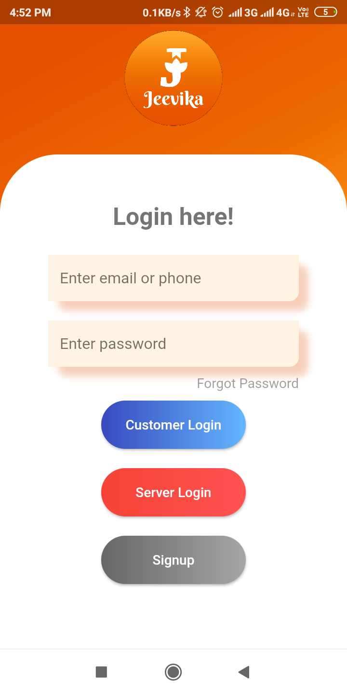
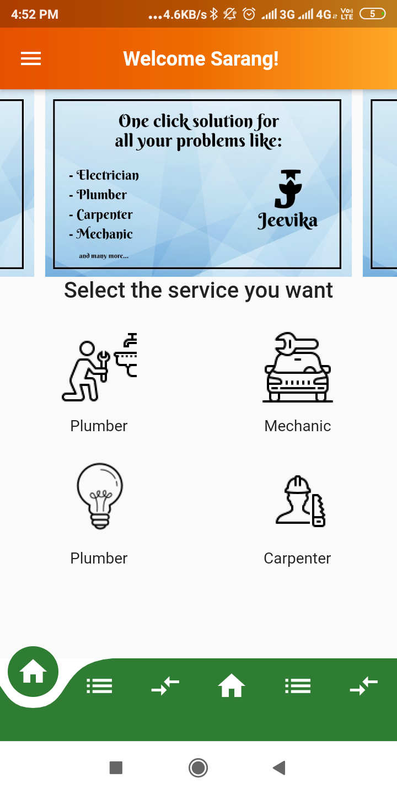
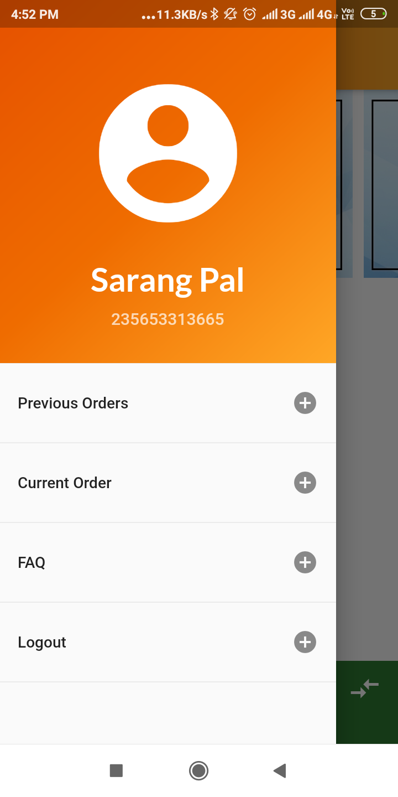
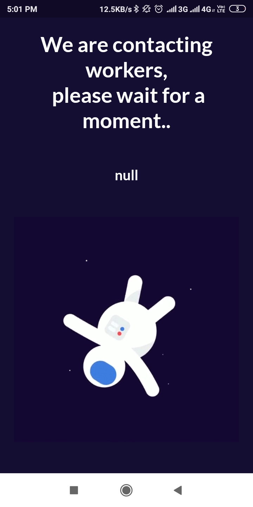
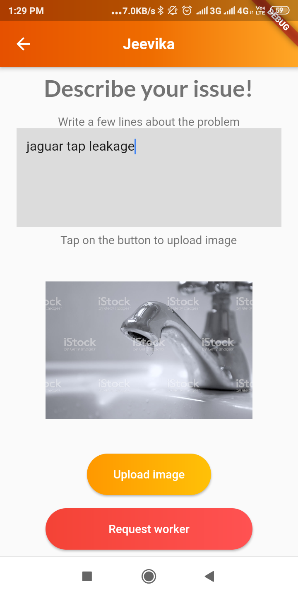
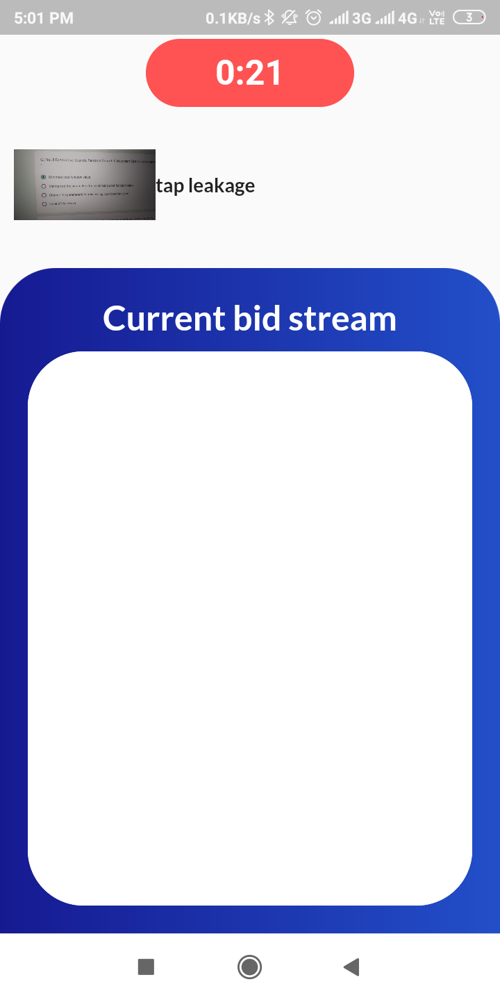
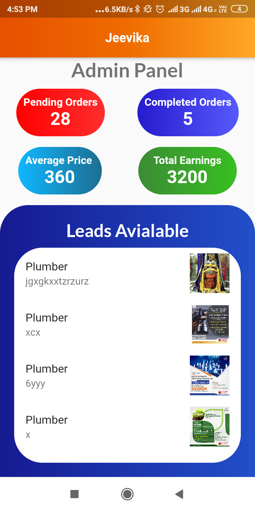
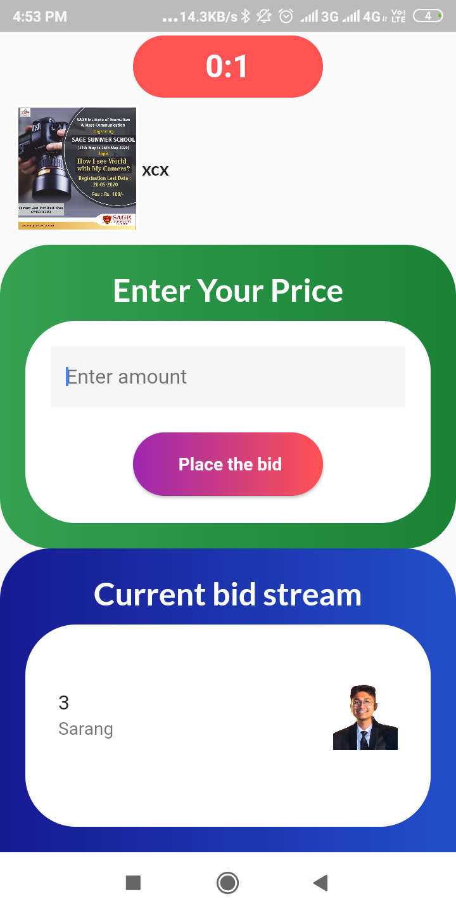
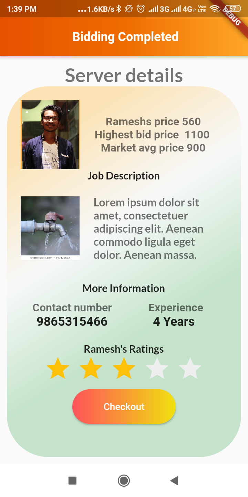

# Jeevika
An application connecting odd job workers to the people who wants to seek their services by bringing them on one portal via a mobile application.

 <h3>Frontend</h3>
 &nbsp&nbspFlutter Framework with dart.
 <h3>Backend</h3>
    &nbsp&nbspCloud firestore/ Firebase.
    
   # UI Design   
  
  <h3>Login Page</h3>
   
   
  <h3>Home Page</h3> 
 

 <h3>Drawer</h3> 
 

<h3>Wait Screen</h3> 
 
 
<h3>Customer description</h3> 
 
 
 
 <h3>Customer Bid Screen</h3> 
 
 
 <h3>Server Leads</h3> 
 

 <h3>Server bidscreen</h3> 
   

 <h3>Server Details</h3> 
 
